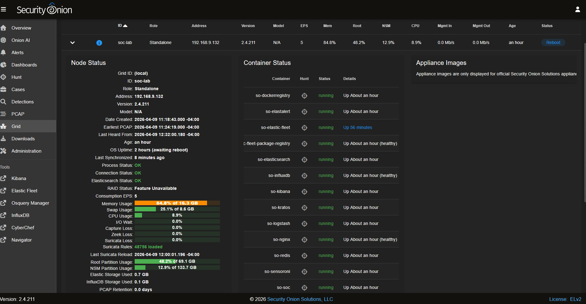
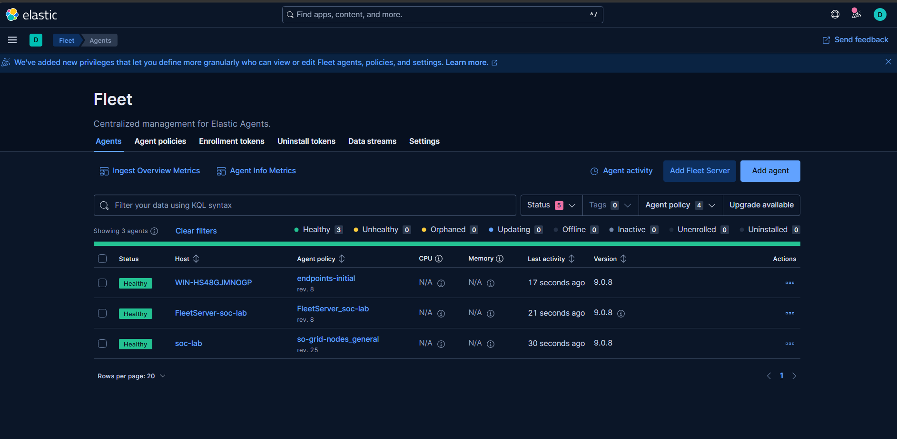
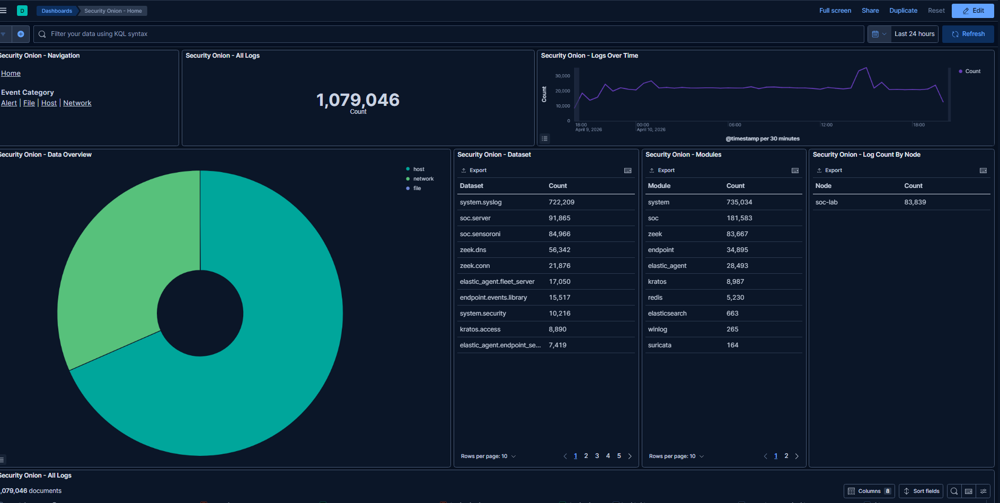
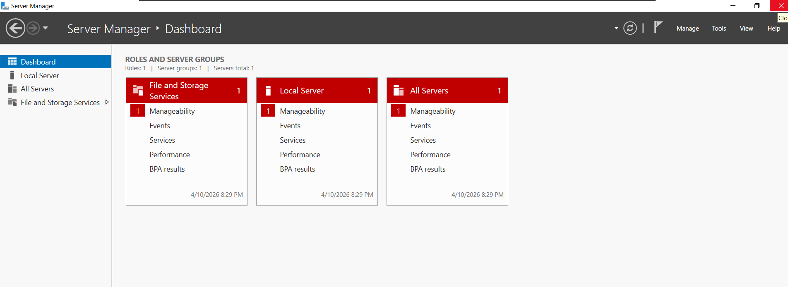
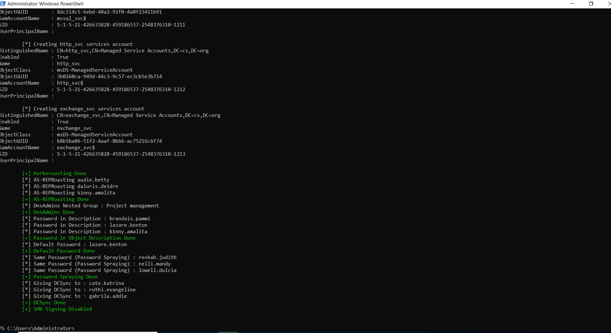
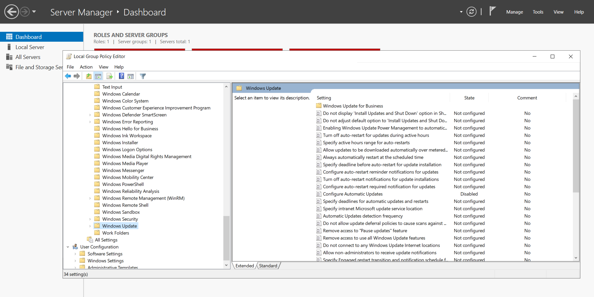

# Security Onion Home SOC Lab with Windows Server 2022 Domain Controller

This project was completed as a supporting home SOC lab build for later detection, investigation, and Active Directory security projects.

---

## Overview

This project documents the setup of a Security Onion home lab with a monitored Windows Server 2022 domain controller.

The goal was to build the foundation needed for later blue-team work, including SIEM analysis, endpoint monitoring, Active Directory attack simulation, and alert investigation.

In this lab, I validated Security Onion node status, confirmed Elastic Fleet agent health, reviewed Security Onion dashboard telemetry, configured a Windows Server 2022 system, created vulnerable Active Directory lab content, and disabled automatic updates to help preserve the lab state.

This project is not presented as an enterprise SOC deployment. It is a controlled home lab used to support hands-on security monitoring and investigation practice.

---

## Why I Built This

Before running attack simulations or writing detection rules, I needed a working lab environment with reliable monitoring.

I built this lab to practice:

1. Standing up a Security Onion monitoring environment.
2. Enrolling systems into Elastic Fleet.
3. Validating endpoint and SIEM visibility.
4. Preparing a Windows Server 2022 domain controller for later Active Directory security testing.
5. Creating intentionally vulnerable AD lab content for future detection exercises.
6. Preserving the lab state so future projects stayed repeatable.

This project became the base environment for the later detection and investigation work in the portfolio.

---

## Lab Environment

| Component | Details |
|---|---|
| Hypervisor | VMware Workstation Player 17 |
| SIEM / SOC Platform | Security Onion |
| Security Onion Version | 2.4.211 |
| Security Onion Node | `soc-lab` |
| Security Onion IP Shown | `192.168.9.132` |
| Windows Server | Windows Server 2022 |
| Windows Hostname | `WIN-HS48GJMNOGP` |
| Active Directory Domain | `cs.org` |
| Fleet / Endpoint Monitoring | Elastic Fleet / Elastic Agent |
| Lab Purpose | Foundation for later AD, SIEM, and detection projects |

---

## Tools Used

| Tool | Purpose |
|---|---|
| Security Onion | SIEM, alerting, dashboards, Hunt, Grid, and log review |
| Elastic Fleet | Agent management and endpoint enrollment review |
| Elastic Agent | Endpoint telemetry collection |
| Windows Server 2022 | Domain controller and monitored endpoint |
| Active Directory Domain Services | Domain controller functionality |
| PowerShell | Lab setup and script execution |
| Local Group Policy Editor | Disabled automatic updates for lab stability |
| VMware Workstation Player | Virtualized lab environment |

---

## Project Flow

The project followed this sequence:

1. Reviewed Security Onion Grid status.
2. Confirmed core Security Onion containers were running.
3. Confirmed Fleet showed healthy enrolled agents.
4. Reviewed Security Onion dashboard telemetry and log volume.
5. Verified Windows Server 2022 was running.
6. Ran vulnerable AD lab setup content.
7. Disabled automatic Windows updates through Group Policy.
8. Confirmed the lab was ready to support later security testing.

---

## Phase 1: Security Onion Grid Review

Security Onion Grid was reviewed to confirm the node and container status.

### What this proved

The Grid view showed the Security Onion node:

`soc-lab`

The address shown was:

`192.168.9.132`

The node role was:

`Standalone`

Several Security Onion containers were shown as running, including services such as Elastic-related components, Kibana, Logstash, Redis, Nginx, and SOC components.

This confirmed that the Security Onion lab node was operational enough to support monitoring and later project work.

The screenshot also showed high memory usage and an OS update notice. That is useful context because home lab resources and maintenance status can affect lab stability.

---

## Phase 2: Elastic Fleet Agent Health

Elastic Fleet was reviewed to confirm enrolled agent health.

### What this proved

Fleet showed three healthy agents:

- `WIN-HS48GJMNOGP`
- `FleetServer-soc-lab`
- `soc-lab`

This confirmed that the Windows Server endpoint and Security Onion-related agents were checking in successfully.

This mattered because later detection projects depended on having endpoint and SIEM telemetry available.

---

## Phase 3: Security Onion Dashboard Review

The Security Onion dashboard was reviewed to confirm log visibility.

### What this proved

The dashboard showed Security Onion ingesting and displaying log data.

The screenshot showed over one million documents in the selected time window and visible datasets/modules such as:

- `system.syslog`
- `soc.server`
- `zeek.dns`
- `zeek.conn`
- `elastic_agent`
- `suricata`
- `winlog`

This confirmed that the lab was collecting and displaying useful telemetry across multiple sources.

This screenshot supports lab visibility, not production-level coverage.

---

## Phase 4: Windows Server 2022 Validation

Windows Server Manager was reviewed on the server system.

### What this proved

The screenshot showed Windows Server Manager open with one managed server.

This supported that the Windows Server system was active and available for configuration.

By itself, this screenshot does not prove every Active Directory configuration detail. It supports the Windows Server lab state used in the broader environment.

---

## Phase 5: Vulnerable Active Directory Lab Content

A vulnerable AD setup script was executed to create intentionally weak lab conditions.

### What this proved

The script output showed vulnerable AD lab content being created or configured, including items related to:

- Managed service accounts
- Kerberoasting setup
- AS-REP roasting setup
- Passwords in descriptions
- Default password patterns
- Password spraying setup
- DCSync-related setup
- SMB signing disabled

This helped prepare the domain for later security testing and detection projects.

These conditions were intentionally created in an isolated lab. They should not be interpreted as safe production settings.

---

## Phase 6: Lab Preservation Policy

Automatic Windows updates were disabled through Local Group Policy.

### What this proved

The screenshot showed the Local Group Policy Editor under Windows Update settings, with automatic updates disabled.

This was done to preserve the lab state and reduce unexpected changes, reboots, or patching during later testing.

This is appropriate for a controlled lab environment, not a general recommendation for production systems.

---

## Key Findings

### 1. Security Onion was operational

The Grid view showed the Security Onion standalone node and running containers.

### 2. Fleet agents were healthy

Elastic Fleet showed healthy agents for the Windows Server endpoint, Fleet Server, and Security Onion node.

### 3. The dashboard showed active telemetry

Security Onion displayed log volume across several datasets and modules.

### 4. Windows Server was available for lab work

Server Manager confirmed the Windows Server system was running and ready for configuration.

### 5. Vulnerable AD content was created for future testing

The script output showed intentionally vulnerable AD conditions being created for later attack and detection exercises.

### 6. Automatic updates were disabled to preserve lab repeatability

The Group Policy screenshot showed update behavior being controlled for lab stability.

---

## Detection and Lab Value

This project provided the foundation for the later portfolio projects.

The value of this lab was not a single detection rule or incident investigation. The value was establishing a working environment where future work could happen:

- Security Onion monitoring
- Elastic Fleet endpoint management
- Windows Server and AD-based testing
- Vulnerable identity lab conditions
- Repeatable attack and detection scenarios

Without this foundation, later projects such as reconnaissance detection, RDP investigation, EQL detection engineering, and Active Directory attack investigation would not have had a stable environment to build on.

---

## Limitations

This was a home lab foundation project, not a production deployment.

Important limitations:

- The lab was built for learning and controlled security testing.
- Vulnerable AD settings were intentionally created and should not be used in production.
- The dashboard screenshot supports telemetry visibility, not complete monitoring coverage.
- The Server Manager screenshot supports Windows Server availability, not every AD configuration detail.
- Endpoint health in Fleet confirms agent check-in, but not every telemetry type or detection capability.
- Some operational details, such as the exact Elastic Agent reinstall steps, are not fully screenshot-supported.
- A production SOC would require stronger architecture, retention planning, access control, tuning, backups, and monitoring validation.

---

## Improvements for a Future Version

If I expanded this project, I would improve it by:

- Adding a network diagram showing Security Onion, Windows Server, and Kali placement.
- Capturing clearer Active Directory Domain Services confirmation.
- Documenting the Elastic Agent enrollment command and troubleshooting steps.
- Adding screenshots of specific endpoint datasets arriving from the Windows Server.
- Capturing Windows Event Log visibility in Elastic.
- Documenting Security Onion firewall hostgroup changes if used.
- Adding baseline validation queries for endpoint, Suricata, Zeek, and Windows logs.
- Recording resource allocation decisions for CPU, memory, and storage.

---

## Screenshot Evidence

| Screenshot | What It Shows |
|---|---|
| `screenshots/01-security-onion-grid.png` | Security Onion node status and running containers |
| `screenshots/02-fleet-healthy-agents.png` | Healthy Fleet agents, including Windows Server and Security Onion-related agents |
| `screenshots/03-security-onion-dashboard.png` | Security Onion dashboard showing log volume and datasets |
| `screenshots/04-domain-controller-server-manager.png` | Windows Server Manager dashboard |
| `screenshots/05-vulnerable-ad-script-output.png` | Vulnerable AD lab setup script output |
| `screenshots/06-disable-auto-updates-gpo.png` | Group Policy view showing automatic updates disabled |

---

## Conclusion

This project established the lab foundation used for later SOC, detection, and Active Directory security projects.

The main result was a working Security Onion home lab with healthy Fleet agents, visible telemetry, a Windows Server environment, vulnerable AD lab content, and settings adjusted to keep the environment repeatable.

It is best understood as the infrastructure layer of the portfolio: not the flashiest project, but the foundation that made the later detection and investigation work possible.